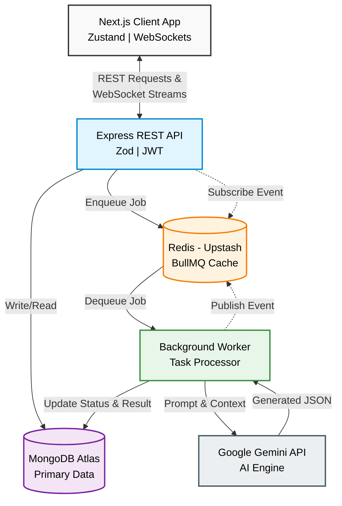
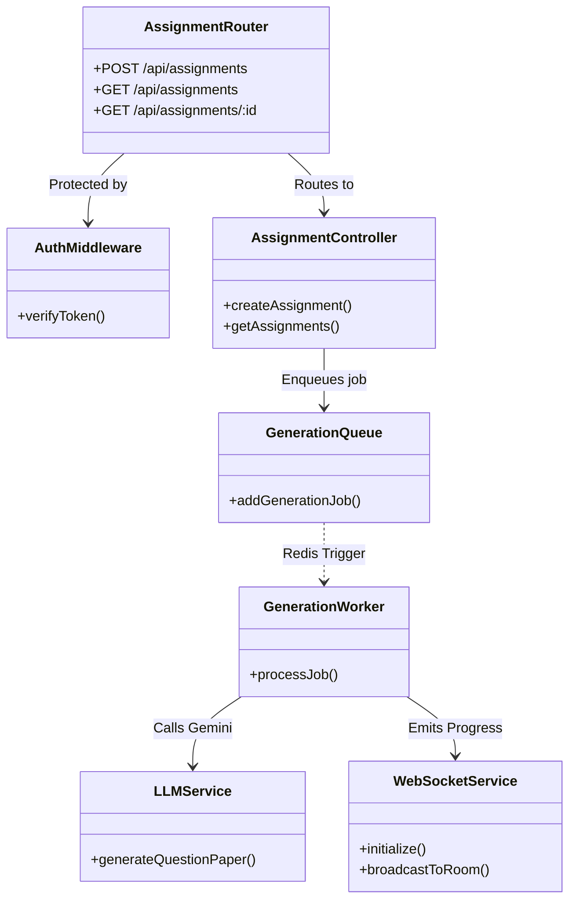
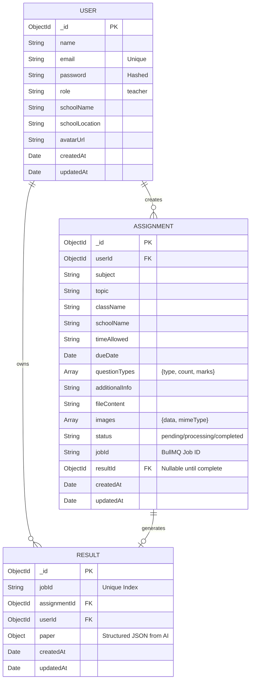
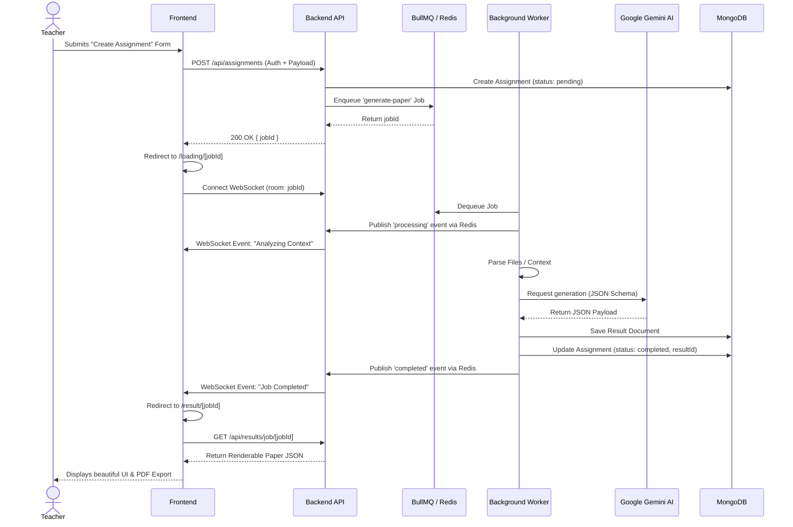

<div align="center">
  <div style="padding: 20px;">
    <!-- Logo or Icon can go here -->
  </div>
  <h1 align="center" style="font-size: 3.5rem; margin-bottom: 10px; font-weight: bold; background: -webkit-linear-gradient(45deg, #0070f3, #00d4ff); -webkit-background-clip: text; -webkit-text-fill-color: transparent;">Flux</h1>
  <p align="center" style="font-size: 1.2rem; color: #666;">
    <strong>Next-Generation AI-Powered Assessment Creation Platform</strong>
  </p>
  <p align="center">
    Flux allows educators to generate comprehensive, highly structured question papers in seconds. By describing a topic, providing context, or uploading reference materials, the AI crafts customized assessments complete with varying difficulty levels, specific question types, and a detailed answer key.
  </p>

  <p align="center">
    
    
    
    
    <br/>
    
    
    
    <br/>
    <a href="https://assignment-flux.vercel.app/">
      
    </a>
  </p>
</div>

<hr />

##  Table of Contents

- [Key Features](#key-features)
- [Technology Stack Breakdown](#technology-stack-breakdown)
- [High-Level Design (HLD)](#high-level-design-hld)
- [Low-Level Design (LLD)](#low-level-design-lld)
- [Database Schema (ERD)](#database-schema-erd)
- [System Flow Diagram](#system-flow-diagram)
- [Local Setup & Installation](#local-setup--installation)
- [API Reference](#api-reference)

---

##  Key Features

-  **AI-Driven Generation:** Leverages Google Gemini 2.5 Flash to create contextual, accurate, and diverse questions.
-  **Asynchronous Processing:** BullMQ & Redis manage generation tasks in the background, ensuring the server remains highly responsive.
-  **Real-Time Updates:** WebSockets stream live progress events (e.g., Analyzing, Generating, Validating) directly to the user's dashboard.
-  **High-Fidelity PDF Export:** Client-side HTML-to-PDF rendering ensures perfect A4 layouts regardless of the user's device.
-  **Secure & Stateless:** Custom JWT-based authentication combined with rigorous Zod payload validation.

---

##  Technology Stack Breakdown

| Technology | Role | Why this choice? |
|---|---|---|
| **Zod** | Validation | Single source of truth for runtime validation on API endpoints, preventing malformed data from reaching the database. |
| **BullMQ + Redis** | Job Queue | AI calls to Gemini can take 5–15 seconds. Pushing them to a background queue prevents HTTP timeouts, frees up the main Node thread, and allows the frontend to poll/stream progress reliably. |
| **WebSocket** | Real-Time Comm | Pushes `job:progress`, `job:completed`, and `job:failed` events directly to the browser tab that submitted the job, so the loading screen updates dynamically. |
| **Zustand** | Client State | Holds the complex multi-step assignment form data in memory (Question counts, types, time allowance). |
| **html2pdf.js** | PDF Generation | Allows perfect 1024px desktop-formatted exports directly from the client, even if the user is on mobile. |
| **JWT** | Authentication | Lightweight, stateless session management, eliminating the need for complex session stores or third-party paid auth providers. |

---


##  High-Level Design (HLD)

The system follows a decoupled, service-oriented architecture. The frontend is a static Next.js application that communicates with a Node.js/Express backend via RESTful APIs and WebSockets. Heavy AI computations are offloaded to asynchronous workers via BullMQ.



### Architecture Highlights
- **Client Tier**: Next.js 15 handles routing and SSR where needed, while Zustand manages complex multi-step form states.
- **API Tier**: Express handles authentication, rate limiting, and request validation (Zod). It provides REST endpoints and a WebSocket server.
- **Message Broker Tier**: Redis (via Upstash) acts as the backbone for BullMQ, managing job queues, retries, and pub/sub for WebSocket events.
- **Worker Tier**: A dedicated Node process picks up generation jobs, communicates with Google Gemini, processes the response, and writes the final structured document to MongoDB.
- **Data Tier**: MongoDB Atlas stores Users, Assignments (job metadata), and Results (the actual generated papers).

---

##  Low-Level Design (LLD)

The backend is modularized to ensure separation of concerns.



### Key Modules
1. **Middlewares**: `auth.middleware.ts` decodes JWTs; `upload.middleware.ts` (Multer) handles context file uploads.
2. **Controllers**: Map HTTP requests to business logic. Validates inputs using `zod`.
3. **Services**: Core logic. `AIService` constructs the Gemini prompts and handles retry logic.
4. **Workers**: BullMQ `Worker` instance that executes the heavy lifting without blocking the main event loop.

---

##  Database Schema (ERD)

The MongoDB schema is designed relationally using `ObjectIds` to link users, their generation requests, and the final results.



---

##  System Flow Diagram

### Assignment Creation & Real-Time Sync
This sequence illustrates how an assignment is requested and how the user is kept updated in real-time.



---

##  Local Setup & Installation

### Prerequisites
- **Node.js**: v18+
- **Docker & Docker Compose**: (optional for local DB/Redis)
- **MongoDB**: A free cluster on MongoDB Atlas (or local instance)
- **Redis**: An Upstash Redis database (or local instance)
- **Google Gemini API Key**: From Google AI Studio

### Environment Variables

You will need to create a `.env` file in the `backend` and `.env.local` in the `frontend`. Here is the dictionary of required variables:

**Backend (`backend/.env`)**
| Variable | Description | Where to get it |
|---|---|---|
| `MONGODB_URI` | Connection string for MongoDB | [MongoDB Atlas](https://www.mongodb.com/cloud/atlas) |
| `REDIS_URL` | Connection string for Upstash Redis | [Upstash Console](https://console.upstash.com/) |
| `GEMINI_API_KEY` | API key for Gemini 2.5 Flash | [Google AI Studio](https://aistudio.google.com/) |
| `JWT_SECRET` | A secure random string for signing JWT tokens | Generate via `openssl rand -hex 32` |
| `FRONTEND_URL` | URL of the Next.js app for CORS | e.g. `http://localhost:3000` |

**Frontend (`frontend/.env.local`)**
| Variable | Description | Where to get it |
|---|---|---|
| `NEXT_PUBLIC_API_URL` | The REST API endpoint of your Express backend | e.g. `http://localhost:4000` |

### Backend Setup
1. Navigate to the backend directory:
   ```bash
   cd backend
   ```
2. Copy the environment template:
   ```bash
   cp .env.example .env
   ```
3. Fill in your `.env` variables (`MONGODB_URI`, `REDIS_URL`, `GEMINI_API_KEY`, `JWT_SECRET`, `FRONTEND_URL`).
4. Install dependencies and start the development server:
   ```bash
   npm install
   npm run dev
   ```
   *The server will run at `http://localhost:4000`.*

### Frontend Setup
1. Navigate to the frontend directory:
   ```bash
   cd frontend
   ```
2. Copy the environment template:
   ```bash
   cp .env.local.example .env.local
   ```
3. Fill in your `.env.local` variables (`NEXT_PUBLIC_API_URL`).
4. Install dependencies and start the application:
   ```bash
   npm install
   npm run dev
   ```
   *The app will run at `http://localhost:3000`.*

---

##  API Reference

Below are the main endpoints exposed by the Express backend. All protected routes require a JWT token in the `Authorization: Bearer <token>` header.

| Method | Endpoint | Description | Auth Required |
|---|---|---|:---:|
| `POST` | `/api/auth/register` | Create a new teacher account | ❌ |
| `POST` | `/api/auth/login` | Login and receive a JWT token | ❌ |
| `GET` | `/api/auth/me` | Fetch details of the currently logged-in user | ✅ |
| `POST` | `/api/assignments` | Submit an assignment configuration to the BullMQ queue | ✅ |
| `GET` | `/api/assignments` | Retrieve a list of all assignments created by the user | ✅ |
| `GET` | `/api/assignments/:id` | Fetch specific metadata about an assignment | ✅ |
| `GET` | `/api/results/job/:jobId` | Retrieve the generated Question Paper JSON by Job ID | ✅ |

---

<div align="center">
  <p><b>Built with  for Educators.</b></p>
</div>
